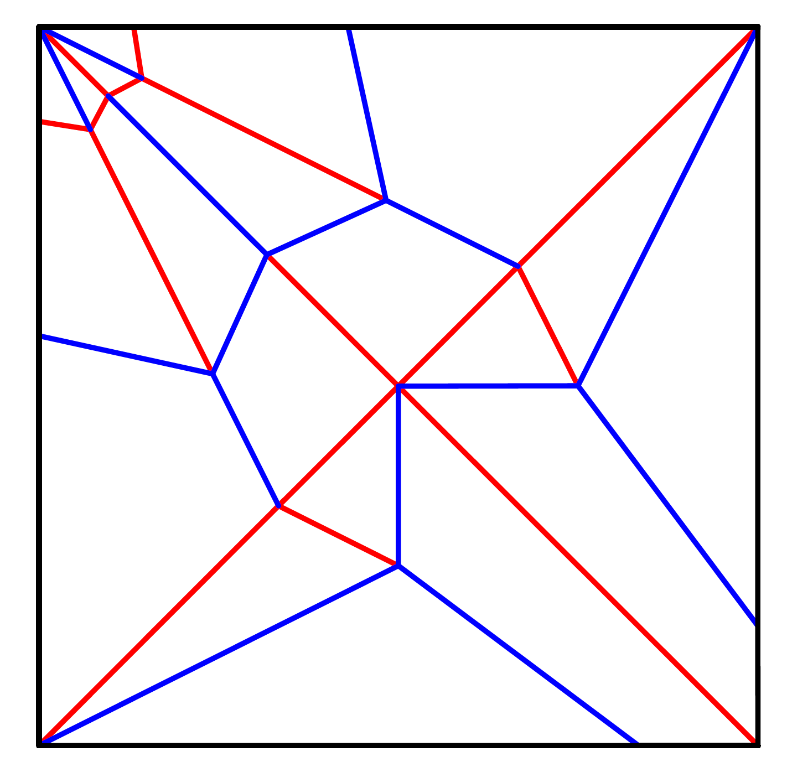

# PatternParser

项目代码地址：[**PatternParser**](https://github.com/592McAvoy/PatternParser)

------


## 一、功能

1. 读取并解析折痕pattern的svg文件
2. 识别所有顶点（vertice）
3. 识别不同类型的边（edge）
4. 对交叉的处的顶点进行识别，并对相关交叉边进行拆分
5. *根据已有的点和边构造面（face）【待完成】
6. *对面片进行三角化（triangulation），添加facet crease【待完成】

## 二、代码解释

本项目主要参考 [OrigamiSimulator](https://github.com/amandaghassaei/OrigamiSimulator)中的` js\pattern.js`实现，使用[tinyxml2](https://github.com/leethomason/tinyxml2)来进行svg文件的解析

### 1. svg格式pattern介绍



svg格式的折痕图片显示如图，但是它的编写格式是xml的形式：

```xml
<!-- assets/Bases/birdBase.svg -->

<?xml version="1.0" encoding="utf-8"?>
<!-- Generator: Adobe Illustrator 16.0.3, SVG Export Plug-In . SVG Version: 6.00 Build 0)  -->
<!DOCTYPE svg PUBLIC "-//W3C//DTD SVG 1.1//EN" "http://www.w3.org/Graphics/SVG/1.1/DTD/svg11.dtd">
<svg version="1.1" id="Layer_1" xmlns="http://www.w3.org/2000/svg" xmlns:xlink="http://www.w3.org/1999/xlink" x="0px" y="0px"
	 width="3456px" height="6912px" viewBox="0 0 3456 6912" enable-background="new 0 0 3456 6912" xml:space="preserve">
<rect x="432" y="288" fill="#FFFFFF" stroke="#000000" stroke-miterlimit="10" width="2016" height="2016"/>
<line opacity="0.5" fill="none" stroke="#0000FF" stroke-miterlimit="10" x1="432" y1="288" x2="2448" y2="2304"/>
<line fill="none" stroke="#FF0000" stroke-miterlimit="10" x1="864" y1="1296" x2="2016" y2="1296"/>
<line fill="none" stroke="#FF0000" stroke-miterlimit="10" x1="1440" y1="720" x2="1440" y2="1872"/>
...
<line fill="none" stroke="#0000FF" stroke-miterlimit="10" x1="1440" y1="1872" x2="1440" y2="2304"/>
<line opacity="0.5" fill="none" stroke="#0000FF" stroke-miterlimit="10" x1="432" y1="2304" x2="2448" y2="288"/>
</svg>
```

通过对 `<svg>` 中的元素（`<rect>`，`<line>`，etc.）进行解析，就可以识别出vertice和不同类型的edge

### 2. load SVG

定义了class `Pattern`来完成对svg的解析：

```c++
// pattern.h

class Pattern {
private:
	string SVGfilename;

	vector<Vertice> verticesRaw;	// 原始的顶点
	vector<Edge> edgesRaw;			// 原始的边

    // 以下是解析时内部使用的一些方法
	void getElementList(vector<XMLElement*> &vec, XMLElement *root, string name);
	float getOpacityAngle(XMLElement* e);
	const string getStroke(XMLElement* e);
	TYPE typeForStroke(const string stroke);

	void parseLine(vector<XMLElement*> &vec);
	void parseRect(vector<XMLElement*> &vec);

	void findIntersections();

	void loadSVG();
	void parseSVG();

public:
    // 完成之后的边缘
	vector<Edge> mountains;
	vector<Edge> valleys;
	vector<Edge> borders;
	vector<Edge> hinges;
	vector<Edge> triangulations;

	Pattern(string filename)
		:SVGfilename(filename){}
	
	void parse(); //对外暴露的解析API
};

```

定义了一些数据结构来表示3D/2D 顶点以及边：

```c++
enum TYPE {
	Border, Mountain, Valley, Cut, Triangulation, Hinge, NONE
};	// 不同的边类型，基础部分应该只会用到前三种

class Vertice
{	
public:
	float x, y, z;
	...
};

class Edge
{
public:
	Vertice v1, v2;
	float angle;
	TYPE type;
    ...
	}
};

struct Vector2 {
	float x, y;
	...
	}
};
```

`loadSVG`函数中识别不同的标签进行了解析：

```c++
void Pattern::loadSVG() {
    // 使用tinyxml2进行load
	XMLDocument svg;
	svg.LoadFile(SVGfilename.c_str());

	if (svg.ErrorID() != 0) {
		cout << "Load svg: " << SVGfilename << " ERROR!" << endl;
		return;
	}

	XMLElement *root = svg.FirstChildElement("svg");
	
    // 读取不同的元素
	vector<XMLElement*> paths, lines, rects, polygens, polylines;
	getElementList(paths, root, "path");
	getElementList(lines, root, "line");
	getElementList(rects, root, "rect");
	getElementList(polygens, root, "polygen");
	getElementList(polylines, root, "polyline");
	
    // 基础部分只有line和rect元素，暂时只对这两种元素进行了解析，后续根据项目的推进会进行补全
	parseLine(lines);
	parseRect(rects);
}
```

### 3. parse SVG

上一步中进行了基础的解析后能得到一些顶点和边，但是这些数据有一点问题：

- 由于是暴力push_back，所以会有很多重复的顶点
- 交叉的两条边会有交点，交点需要被识别，交叉的边要被拆解成几条边

`parseSVG`函数中处理了上述问题：

```c++
void Pattern::parseSVG() {
	// remove duplicate vertices and edges
	UniqueVertices(verticesRaw);
	UniqueEdges(edgesRaw);

    // 处理Intersection
	findIntersections();

	// remove duplicate vertices and edges
	UniqueVertices(verticesRaw);
	UniqueEdges(edgesRaw);

}
```

## 三、输出

目前将顶点和边分别存在`verticesRaw`，`edgesRaw`两个数组中，对`assets/Bases/birdBase.svg`解析的结果如下：

```asm
# edgesRaw
length: 28
type: Mountain  v1 (432,288,0)  v2 (1440,720,0) angle: -0
type: Mountain  v1 (432,288,0)  v2 (864,1296,0) angle: -0
type: Border    v1 (432,1296,0) v2 (432,288,0)  angle: 0
type: Border    v1 (432,1296,0) v2 (432,2304,0) angle: 0
type: Mountain  v1 (432,2304,0) v2 (1440,1872,0)        angle: -0
type: Mountain  v1 (432,2304,0) v2 (864,1296,0) angle: -0
type: Valley    v1 (864,1296,0) v2 (432,1296,0) angle: 0
type: Border    v1 (1440,288,0) v2 (432,288,0)  angle: 0
type: Border    v1 (1440,288,0) v2 (2448,288,0) angle: 0
type: Valley    v1 (1440,720,0) v2 (1440,288,0) angle: 0
type: Valley    v1 (1440,1296,0)        v2 (432,288,0)  angle: 1.5708
type: Valley    v1 (1440,1296,0)        v2 (2448,2304,0)        angle: 1.5708
type: Valley    v1 (1440,1296,0)        v2 (432,2304,0) angle: 1.5708
type: Valley    v1 (1440,1296,0)        v2 (2448,288,0) angle: 1.5708
type: Mountain  v1 (1440,1296,0)        v2 (864,1296,0) angle: -0
type: Mountain  v1 (1440,1296,0)        v2 (2016,1296,0)        angle: -0
type: Mountain  v1 (1440,1296,0)        v2 (1440,720,0) angle: -0
type: Mountain  v1 (1440,1296,0)        v2 (1440,1872,0)        angle: -0
type: Valley    v1 (1440,1872,0)        v2 (1440,2304,0)        angle: 0
type: Border    v1 (1440,2304,0)        v2 (432,2304,0) angle: 0
type: Border    v1 (1440,2304,0)        v2 (2448,2304,0)        angle: 0
type: Valley    v1 (2016,1296,0)        v2 (2448,1296,0)        angle: 0
type: Mountain  v1 (2448,288,0) v2 (1440,720,0) angle: -0
type: Mountain  v1 (2448,288,0) v2 (2016,1296,0)        angle: -0
type: Border    v1 (2448,1296,0)        v2 (2448,288,0) angle: 0
type: Border    v1 (2448,1296,0)        v2 (2448,2304,0)        angle: 0
type: Mountain  v1 (2448,2304,0)        v2 (2016,1296,0)        angle: -0
type: Mountain  v1 (2448,2304,0)        v2 (1440,1872,0)        angle: -0

# verticesRaw
length: 13
v (432,288,0)
v (432,1296,0)
v (432,2304,0)
v (864,1296,0)
v (1440,288,0)
v (1440,720,0)
v (1440,1296,0) # 此为识别添加的交点
v (1440,1872,0)
v (1440,2304,0)
v (2016,1296,0)
v (2448,288,0)
v (2448,1296,0)
v (2448,2304,0)
```

