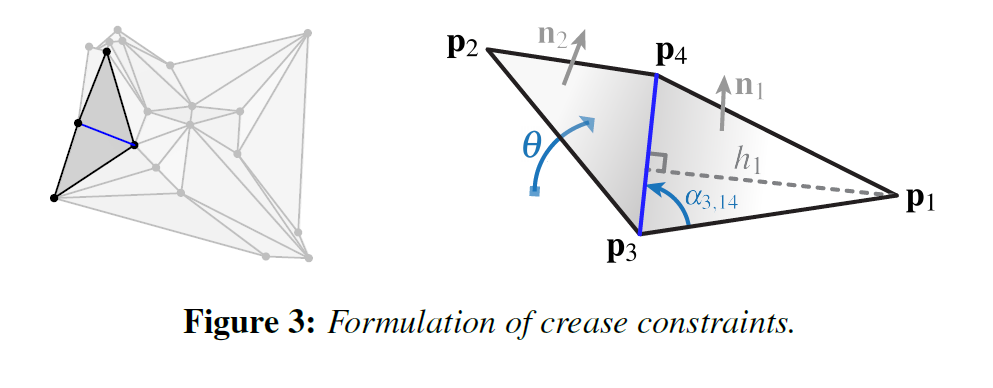
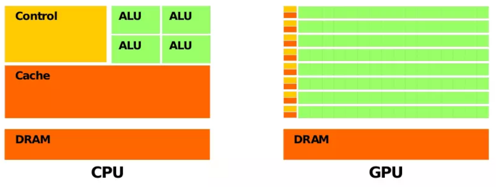

 # GP团队大作业 - 折纸仿真引擎


## 一、 项目介绍

折纸不仅仅是一种有趣的游戏，其中也蕴含着许多知识，如几何、拓扑变换、微积分等。对折纸的过程进行物理建模可以更好地理解折痕是如何影响其折叠形状和状态的。

VR环境下的折纸模拟和交互可以提供更直观的方式来编辑折痕Pattern并强化几何约束。仿真也提供了一种逆向的设计方法，可以根据用户指定的折纸目标利用计算工具来生成对应的折痕Pattern。

我们的工作旨在创建一个快速、交互式的VR模拟环境，能够支持用户基于一张有折痕的纸，参照提示进行折叠，完成完成具有真实感的、符合几何约束和现实情况的折纸作品。


## 二、预期实现目标

### 1. 基本要求：

- 实现基本纸张的模拟，能够支持纸张弯曲、折叠、裁剪，并在变形过程中维持拓扑结构；
- 支持至少几种基本的折纸模型（如 [ORIGAMI SIMULATOR](http://apps.amandaghassaei.com/OrigamiSimulator/) 中的 Examples/Origami/Flapping Bird）；
- 支持有一定裁剪的折纸模型（如 [ORIGAMI SIMULATOR](http://apps.amandaghassaei.com/OrigamiSimulator/) 中的 Example/Popups ）；
- 能够通过**物理地模拟纸张**受力时候的形态变化，从而折叠形变过程中保持纸张形状，维持面片、角度的约束；
- 能够支持用户通过基于 VR 的交互，自由地从一张白纸折叠出一定的折纸作品；

### 2. 进阶要求：

- 实现难度更高的折纸结构的力学模拟；
  - 支持密铺 tessellation 折纸（如 [ORIGAMI SIMULATOR](http://apps.amandaghassaei.com/OrigamiSimulator/)/Example/Tessellations/Miura-Ori 和 [ORIGAMI SIMULATOR](http://apps.amandaghassaei.com/OrigamiSimulator/)/Example/Tessellations/Stars-Triangles）；
  - 支持有弧度的折纸（如 [ORIGAMI SIMULATOR](http://apps.amandaghassaei.com/OrigamiSimulator/)/Example/Curved Creases/Huffman Tower）；

### 3. 创新点：

- 支持不同材质的纸张的折叠效果（不同的shader和约束参数）
- 支持按步骤折叠，生成每一步的折叠效果
- 支持折纸成品的动画
- 尝试对外部输入的折纸Pattern进行建模并支持折纸过程
- 实现折叠过程中纸张受力和法向量变化的可视化

  

## 三、 预计使用的技术

### 1. 搭建VR交互环境

### 2. 实现纸张的物理模拟

根据论文《[Fast, Interactive Origami Simulation using GPU Computation](http://dalab.se.sjtu.edu.cn/gp/pj/2018-FastInteractiveOrigamiSimGPU.pdf)》中的方法实现对纸张/折痕/顶点的物理建模

#### 2.1 Meshing

首先要把折纸的折痕Pattern离散为三角面片，对于四边形的面片可以通过增加额外的边（facet creases）来实现三角化。

离散后的面片由有三种折痕构成：facet crease、mountain crease（折叠时向外凸出的折痕）、valley crease（折叠时向内凹的折痕）。

最终的mesh中的每个edge都被建模为销连接桁架中的梁，按照弹簧模型来施加轴向和角度约束。

#### 2.2 Axial Constraints

轴向约束目的是为了防止折叠期间折纸表面的拉伸和压缩。每个beam element的运动类似于线性弹性弹簧，其仅在其轴向方向上施加力。通过计算每根梁轴向上的力（局部坐标），再转换为全局坐标上的力，最后施加到node上来实现轴向约束。

根据胡克定律和chain rule:
$$
\vec F_{axial} = - k_{axial}(l - l_0) \frac{\partial l}{\partial \vec p} \\\
\vec k_{axial}: 梁的轴向胡克系数 \\\
\vec p: node的位置 \\\
l: 梁当前长度 \\\
l_0: 梁的原长
$$
每根梁的两个node：
$$
\frac {\partial l}{\partial \vec p_1} = - \hat I_{12}, \frac {\partial l}{\partial \vec p_2} = \hat I_{12} \\\
\hat I_{12}: 从node1到node2的unit \ vector \\\
p_1: node1在全局坐标中的3D位置。
$$
对于胡克系数：
$$
k_{axial} = \frac { EA} {l_0} \\\
其中E是杨氏模量，A是梁的横截面，在这里为了方便计算就把EA看做常量
$$
于是每根梁的胡克系数只与自己的原长有关。

#### 2.3 Crease Constraints

通过增加对网格的三角形面之间二面角的约束，来驱动和约束折叠。角度约束被建模为线性弹性扭转弹簧（linear-elastic torsional springs），将相邻三角形面朝向某个目标折叠角度驱动
$$
\vec F_{crease} = - k_{crease} (\theta - \theta_{target}) \frac {\partial \theta}{\partial \vec p} \\\
\vec F_{crease}: 全局坐标中的3D力向量 \\\
\theta_{target}: 目标折叠角 \\\
\vec p: node位置 \\\
k_{crease}: 约束的刚性（stiffness）
$$
这里的stiffness（也就是K_crease) 受折痕的种类的影响：
$$
\begin{equation}
k_{crease} = 
\begin{cases}
{l_0 k_{flod}} & \text{moutain or valley crease} \\
{l_0 k_{facet}} & \text{facet crease} \\
{0} & \text {boundary edge or undriven crease}
\end{cases}
\end{equation}
$$
论文中提到这里通过选择stiffness来使得（初步猜想是使得轴向约束远大于角度约束）
$$
k_{axial} >> k_{flod}, k_{axial} >> k_{facet}
$$
目标折叠角度和折痕种类也是有关的（这个关系比较符合常理）
$$
\begin{equation}
\theta_{target} = 
\begin{cases}
{<0}& \text{mountaion crease} \\
{>0}& \text{valley crease} \\
0 & \text{facet crease}
\end{cases}
\end{equation}
$$


每个角度约束会给4个node施加力（角度和nodes如上图）
$$
\frac{\partial \theta}{\partial \vec p_1} = \frac{\vec n_1}{h_1}, \\\
\frac{\partial \theta}{\partial \vec p_2} = \frac{\vec n_2}{h_2}, \\\
\frac{\partial \theta}{\partial \vec p_3} = \frac{-cot \alpha_{4,31}}{cot \alpha_{3,14}+cot \alpha_{4,31}}\frac{\vec n_1}{h_1} + \frac{-cot \alpha_{4,23}}{cot \alpha_{3,42}+cot \alpha_{4,23}}\frac{\vec n_2}{h_2}, \\\
\frac{\partial \theta}{\partial \vec p_4} = \frac{-cot \alpha_{3,14}}{cot \alpha_{3,14}+cot \alpha_{4,31}}\frac{\vec n_1}{h_1} + \frac{-cot \alpha_{3,42}}{cot \alpha_{3,42}+cot \alpha_{4,23}}\frac{\vec n_2}{h_2} \\\
\alpha_{1, 23}：以p_1为顶点，p_2, p_3分别在两边的角 \\\
h_1,h_2: 以p_1, p_2为顶点的高
$$

#### 2.4 Face Constraints

仅使用轴向约束和角度约束，就可以进行折叠的模拟了。然而这样的模拟会有折叠的表面剪切的问题。在网格的三角形面的每个内角上增加约束有助于防止折叠表面的剪切，特别是对于高纵横比三角形。

面约束也之前的约束一样，被建模为线性弹性弹簧。
$$
\vec F_{face} = - k_{face} (\alpha - \alpha_0) \frac{\partial \alpha} {\partial \vec p} \\\
\alpha: 当前角度 \\\
\alpha_0: 初始（还是flat状态的时候）状态下的角度 \\\
\vec k_{face}: 是面约束的刚性（stiffness） \\\
\vec p:这里的p是指邻接的node的位置
$$
偏导数公式：
$$
\frac{\partial \vec p_1}{\partial \alpha_{2,31}} = \frac{\vec n \times (\vec p_1-\vec p_2)}{\parallel \vec p_1-\vec p_2 \parallel ^2} \\
\frac{\partial \vec p_2}{\partial \alpha_{2,31}} = - \frac{\vec n \times (\vec p_1-\vec p_2)}{\parallel \vec p_1-\vec p_2 \parallel ^2} + \frac{\vec n \times (\vec p_3-\vec p_2)}{\parallel \vec p_3-\vec p_2 \parallel ^2}\\
\frac{\partial \vec p_3}{\partial \alpha_{2,31}} = - \frac{\vec n \times (\vec p_3-\vec p_2)}{\parallel \vec p_3-\vec p_2 \parallel ^2} \\
$$

#### 2.5 Numerical Integration

根据轴向约束、角度约束和面约束，一个node受到的总的力：
$$
\vec F_{total} = \sum_{beams} {\vec F_{beam}} + \sum_{creases} {\vec F_{crease}} + \sum_{faces}{\vec F_{face}}
$$
于是得到该node的加速度：
$$
\vec a = \frac{\vec F_{total}} {m}
$$
在论文的推导过程中，将m假定为1，在真正模拟时，选用更加准确的质量值应该可以获得更加真实的力学模拟效果。

计算node的速度和位置时使用了显式Euler法（实现时可以尝试Verlet方法）：
$$
\vec v_{t + \Delta t} = \vec v_t + \vec a \Delta t, \\\
\vec P_{t+\Delta t} = \vec  P_t + \vec v_{t+\Delta t}\Delta t
$$
对于步长的选择，为了使得模拟过程能够保持稳定，需要满足
$$
\Delta t < \frac{1}{2 \pi \omega_{max}}, \\\

\omega_{max}: 模型中所有约束中的最大固有频率 \\\
由于 k_{axial} \gg k_{flod}, k_{axial} \gg k_{face}，所以 \\\

\omega = \sqrt{\frac{k_{axial}}{m_{min}}}, \\\

m_{min}: 一个beam中质量较小的node的重量 \\\
同时给定初始值：\\\

\vec v_0 = \vec 0
$$
为了能够在有限的迭代中得到稳定的状态，在邻接的vertices中加入了粘性阻尼：
$$
\vec F_{damping} = c(\vec v_{neighbor} - \vec v), \\
c: 粘性阻尼系数
$$
使用更加精确的阻尼和使用更精确的质量一样，都可以得到更加真实的力学模拟效果。

### 3. 尝试使用GPU并行计算和渲染

CPU的结构复杂，主要完成逻辑控制和缓存功能，运算单元较少。与CPU相比，GPU的设计目的是尽可能的快速完成图像处理，通过简化逻辑控制并增加运算单元实现了高性能的并行计算。



和常见的vertex shader和fragment shader类似，要在GPU运行我们自己设定的逻辑也需要通过shader，不过和传统的shader的不同之处在于，compute shader并非传统的渲染流水线中的一个阶段，相反它主要用来计算原本由CPU处理的通用计算任务，这些通用计算常常与图形处理没有任何关系，因此这种方式也被称为**GPGPU**（General-purpose computing on graphics processing units，图形处理器通用计算）。

根据[Unity - Manual: Compute shaders](https://docs.unity3d.com/Manual/class-ComputeShader.html) ，可以使用后缀为`.compute`的assets来编写compute shader，一个示例如下：

```c#
// test.compute

#pragma kernel CSMain	//定义入口函数

RWTexture2D<float4> res;	

[numthreads(1,1,1)]	//指明多线程模型
void CSMain (uint3 dtid : SV_DispatchThreadID)
{
    res[dtid.xy] = float4(1,0,0,1);
}
```

和一般的shader不同，compute shader和图形无关，因此在使用compute shader时不会涉及到mesh、material这些内容。相反，compute shader的设置和执行要在c#脚本中进行。

```
 this.kernelHandle = cshader.FindKernel("CSMain");
 ......
 cshader.SetBuffer(this.kernelHandle, "boidBuffer", buffer);
 ......
 cshader.Dispatch(this.kernelHandle, this.boidsCount, 1, 1);
 buffer.GetData(this.boidsData);
 ......
```

在c#脚本中准备、传送数据，分配线程组并执行compute shader，最后数据再从GPU传递回CPU。

## 四、 组内暂定分工

VR

折纸物理引擎
